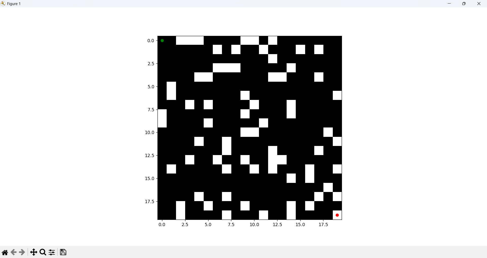
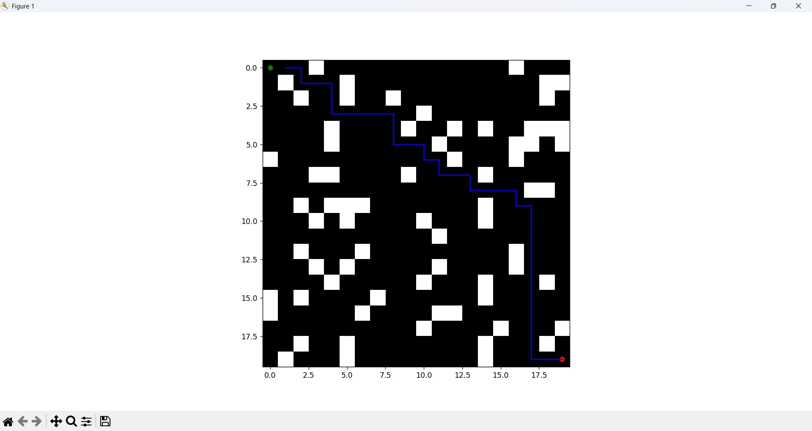
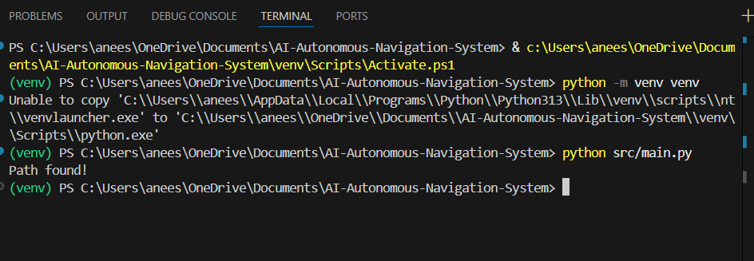

# AI-Based Autonomous Navigation System

## Overview
A simulation-based AI system that navigates from start to goal using A* algorithm.

## Tech Stack
- Python
- NumPy
- Matplotlib

## Features
- Path planning
- Obstacle avoidance
- Visualization

## Screenshots

## Run
python src/main.py